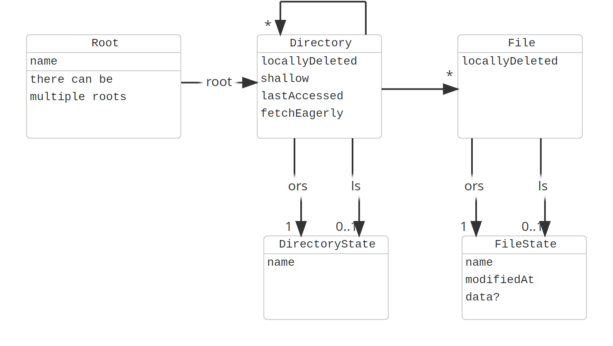

# google-drive-client

Google Drive Client with support for lazy synchronization and offline operation

## Overview

Unfortunately, there is no official Google Drive client for Linux. There are a few options, most notably

- [Google Drive OcamlFuse](https://github.com/astrada/google-drive-ocamlfuse): does not support offline operation
- [Rclone](https://rclone.org/): Supports bidirectional synchronization, but always replicates the whole directory

The goal of this project is to create a client using FUSE to support lazy synchronization, with caching and offline capabilities.

The client maintains an Observed Remote State (ORS), capturing the state last seen on the server and downloaded to the client. Then there is the Local State (LS), which is what is mounted via the FUSE file system. As long as there are no local changes, the LS matches the ORS.

When changes are detected on the server, the changes are downloaded and the ORS is updated. If there are already local changes, a conflict occurred. It is resolved by for example renaming the local file.

Local changes are uploaded to the server as soon as possible.

## Data Structure

The data model is centered around a hierarchical structure of `Directory` and `File` entities, which mirror the Google Drive structure.

- **Root**: Represents the starting point, allowing for multiple roots.
- **Directory**: Can contain subdirectories or files. It tracks metadata like `locallyDeleted`, `shallow` (indicating partial loading), `lastAccessed`, and `fetchEagerly`.
- **File**: Represents individual files, tracking a `locallyDeleted` flag.

Both `Directory` and `File` maintain two states:
- **ORS (Observed Remote State)**: Represents the state as seen on the server.
- **LS (Local State)**: Represents the state as it exists locally (0..1 relationship, as it might not be fully synced or loaded).

The `DirectoryState` and `FileState` capture specific attributes for their respective entities, such as `name`, `modifiedAt` for files, and others.

## Technologies

- Main implementation language: Java
- FUSE via https://github.com/serceman/jnr-fuse
- Persistence: https://www.h2database.com/html/mvstore.html
- Google Drive API Client: https://developers.google.com/workspace/drive/api/quickstart/java
- Thunar Extensions: https://developer.xfce.org/thunar/index.html
- Tray Notification: https://github.com/dorkbox/SystemTray
